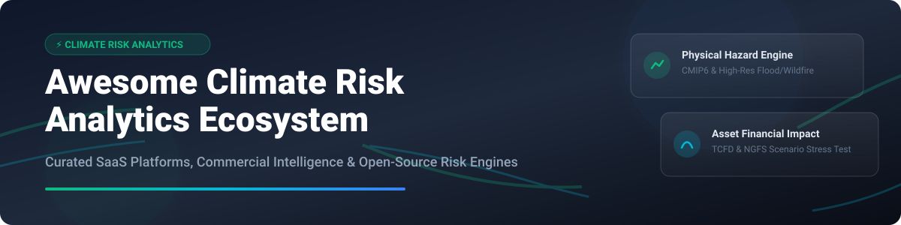

# 🌍 Awesome Climate Risk Analytics Ecosystem 📊

  
  
  
  

> **A comprehensive, curated repository of enterprise SaaS platforms, climate risk intelligence providers, and open-source climate hazard engines.**
> *Translating climate science, CMIP6 data, physical hazard modeling, asset-level vulnerability scoring, and NGFS/TCFD scenario stress testing into actionable financial risk translation.*

---

## 📌 Table of Contents
- [🌐 Market Overview & Market Size](#-market-overview--market-size)
- [🏢 SaaS & Hosted Commercial Platforms](#-saas--hosted-commercial-platforms)
- [🔓 Open-Source GitHub Projects & Engines](#-open-source-github-projects--engines)
- [🤝 How to Contribute](#-how-to-contribute)
- [💖 Support & Sponsorship](#-support--sponsorship)
- [📈 Star History](#-star-history)
- [⚠️ Disclaimer](#%EF%B8%8F-disclaimer)

---

## 🌐 Market Overview & Market Size

> 💡 **Market Size & Structure**: The global **Climate Risk Analytics & Financial Impact Market** was estimated at **~$1.6 Billion in 2025** and is projected to reach **~$4.8 Billion by 2032** (CAGR ~16.5%). 
> 
> 🏛️ **Market Dynamics**: The sector is **moderately fragmented**, undergoing rapid transition. While enterprise financial institutions and insurance majors lean on dominant category leaders (e.g., Jupiter Intelligence, Moody's Four Twenty Seven, MSCI/Carbon Delta), market consolidation is accelerating alongside emerging open-source standards (such as Linux Foundation OS-Climate).

---

## 🏢 SaaS & Hosted Commercial Platforms

Below is a comparative breakdown of top commercial climate risk platforms, ordered by estimated market footprint / funding size (descending).

| Platform | Company Size (Est. Valuation / Capital Raised) | Specific Starting Pricing | Free Tier / Trial Limit | Key Focus & Features |
| :--- | :--- | :--- | :--- | :--- |
| **[Jupiter Intelligence](https://www.jupiterintel.com/)** 🚀 | ~$100M+ Raised (Est. Valuation ~$300M+) | ~$25,000/year base enterprise seat | No free trial; non-profit access via *"The Jupiter Promise"* program | Asset-level physical risk financial loss translation & high-res hazard scoring. |
| **[Four Twenty Seven](https://427mt.com/)** (Moody's) 🏢 | Acquired by Moody's (Acquisition ~$100M+) | ~$20,000/year institutional tier | 14-day enterprise trial available upon institutional request | Physical risk scoring for sovereign debt, real estate, and municipal bond portfolios. |
| **[Climate X](https://www.climate-x.com/)** 🔮 | ~$30M+ Total Funding | £12,000/year (~$15,000/yr) entry tier | 7-day limited sandbox trial for verified corporate email users | Spectra platform for hazard coverage, asset-level loss curves, & scenario modeling. |
| **[One Concern](https://www.oneconcern.com/)** 🛡️ | ~$120M+ Total Funding | ~$15,000/year commercial license | 14-day customized demo trial for corporate risk managers | Digital twin & resilience analytics focused on business disruption & infrastructure. |
| **[ClimateAI](https://climate.ai/)** 🌾 | ~$35M+ Total Funding | ~$12,000/year entry subscription | 14-day pilot access for agricultural supply chain enterprise leads | Supply chain climate resilience, crop risk modeling, & extreme weather forecasts. |
| **[Cervest](https://www.cervest.earth/)** 🌍 | ~$30M+ Total Funding | £10,000/year (~$12,500/yr) team tier | Free basic account with limit of 3 asset searches & basic hazard overview | Asset-level Climate Intelligence Platform (CIP) & portfolio monitoring. |
| **[Mitiga Solutions](https://www.mitigasolutions.com/)** 🌋 | ~$15M+ Total Funding | €8,000/year (~$8,700/yr) starter tier | 14-day EarthScan platform trial upon request | EarthScan hazard modeling, volcanic ash, wildfire, & insurance risk transfer. |
| **[RisQ](https://www.risq.io/)** 🏙️ | Acquired by Intercontinental Exchange (ICE) | ~$7,500/year municipal module | 30-day trial for municipal finance analysts & institutional investors | Real-estate & municipal bond environmental exposure scoring. |
| **[Faura](https://www.faura.io/)** 🏡 | Seed-funded (~$3M+ Raised) | ~$300/month (~$3,600/yr) starter plan | 14-day free trial with max 50 property address assessments | Property-level natural hazard risk assessment & insurer mitigation scoring. |
| **[ClimateCheck](https://www.climatecheck.com/)** 📍 | Early Stage (~$5M+ Raised) | $19 per individual address report / $2,500 API package | 100% Free search for individual US property addresses (1-100 hazard score) | Granular property-level climate risk scores for real estate due diligence. |

---

## 🔓 Open-Source GitHub Projects & Engines

Curated open-source software libraries, hazard engines, and climate risk frameworks sorted by GitHub Stars_Count (descending).

-  **[pangeo-data/pangeo](https://github.com/pangeo-data/pangeo)** 🌌  
  Ecosystem of open-source tools for ocean, atmosphere, land, and climate data analytics at scale using Xarray, Dask, and Jupyter.

-  **[CLIMADA-project/climada_python](https://github.com/CLIMADA-project/climada_python)** 🧮  
  ETH Zürich's open-source probabilistic natural hazard and climate risk modeling platform for calculating Expected Annual Damage (EAD).

-  **[pydata/xarray](https://github.com/pydata/xarray)** 📐  
  N-D labeled arrays and datasets in Python, foundational for processing CMIP6, NetCDF, and GRIB climate hazard datasets.

-  **[deltares/dflowfm-tools](https://github.com/deltares/dflowfm-tools)** 🌊  
  Deltares open tools for hydrodynamic, coastal, and inland flood risk modeling.

-  **[os-climate/physrisk](https://github.com/os-climate/physrisk)** ⚡  
  Linux Foundation OS-Climate physical climate risk calculation engine for asset and portfolio financial loss scoring.

-  **[os-climate/hazard](https://github.com/os-climate/hazard)** 🌪️  
  Open data pipeline and transformation tools for creating standardized hazard indicators in OS-Climate workflows.

-  **[os-climate/osc-physrisk-financial](https://github.com/os-climate/osc-physrisk-financial)** 💰  
  Open financial valuation modules for translating physical climate hazard exposure into financial metrics (PD, LGD, asset impairment).

---

## 🤝 How to Contribute

1. 🍴 Fork the repository.
2. 📝 Add or update entries in `README.md` following the established table / list format.
3. 🔗 Ensure all links, descriptions, pricing details, and repository tags are accurate.
4. 📥 Submit a Pull Request with a clear description of changes.

---

## 💖 Support & Sponsorship

If you find this repository valuable for your climate risk research, ESG analysis, or sustainable finance projects:
- ⭐ **Star this repository** to help others discover it!
- 🔀 **Fork it** to customize your own workflows.
- 📢 **Share it** with fellow climate data scientists and risk managers.
- ☕ **Buy me a coffee**: Support ongoing maintenance via [GitHub Sponsors](https://github.com/sponsors/ishandutta2007).

---

## 📈 Star History

---

## ⚠️ Disclaimer

- This repository is a **community-curated list** provided for informational and educational purposes.
- Product descriptions, valuations, and pricing tiers reflect estimated public data as of 2026 and do not constitute financial advice or formal commercial solicitations.
- Open-source risk engines should be validated before use in regulatory compliance (e.g., TCFD, CSRD, NGFS) or commercial underwriting.

---

  <i>Made with ❤️ for climate risk analysts, quants, and sustainable finance advocates worldwide.</i>

